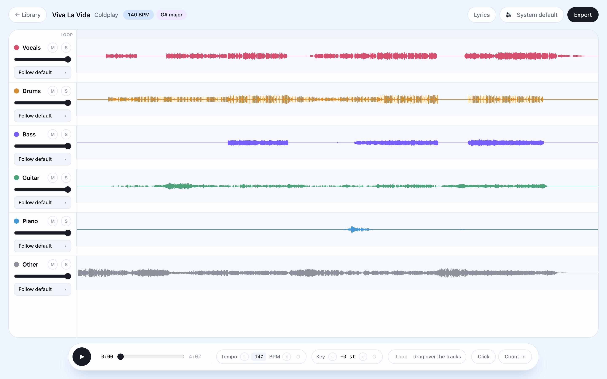

# Timbrel

**Turn any song into your backing band.**

Timbrel is a free, open-source desktop studio that splits music into six stems — vocals, drums, bass, guitar, piano & other — then hands you the mixing desk: mute your part and play it yourself, loop the hard bars, bend tempo and key, and follow synced lyrics. Fully local: no cloud, no account, nothing leaves your device.

**Website:** [timbrel.samz.in](https://timbrel.samz.in) · **License:** [MIT](./LICENSE)



## What it does

- **Six stems from any song** — Demucs (`htdemucs_6s`) runs on your own GPU or Apple Silicon; a typical song separates in about 30 seconds, with BPM and key detected on the way.
- **Search YouTube, or drop a file** — one omnibox: find any song via yt-dlp, or drag in your own mp3 / wav / flac / m4a.
- **Practice tools** — per-stem mute/solo/volume, loop regions, real-time tempo and key (semitone) shifting, metronome click and count-in.
- **Synced lyrics** — fetched automatically from LRCLIB, scrolling with the playhead.
- **Multi-device output routing** — send any stem (or the click) to any output device: click to the drummer's in-ears, vocals to the singer's headphones, the rest to the PA.
- **Playlists & export** — group songs into setlists; export stems, mixdowns, minus-one versions or click tracks, all FLAC.

Your library lives in plain files on disk — FLAC stems and a local SQLite database. Only YouTube search and lyrics need the network; everything else works offline.

## Build from source

Prerequisites: **Node 22+**, **pnpm 9**, **Python 3.11** (3.13 won't work — Demucs' dependencies lack wheels), and `ffmpeg` on PATH for compressed inputs.

```sh
git clone https://github.com/SammitBadodekar/timbrel
cd timbrel && pnpm install

# one-time: the Python separation engine
cd sidecar
python3.11 -m venv .venv && source .venv/bin/activate
pip install -r requirements.txt
cd ..

# run the desktop app
pnpm --filter desktop dev
```

The Electron app auto-detects `sidecar/.venv` in dev. See [`sidecar/README.md`](./sidecar/README.md) for the stdio protocol and engine details.

## How it's put together

| Path | What it is |
| --- | --- |
| `apps/desktop` | The app — Electron + React + Tailwind, Zustand stores, Web Audio engine |
| `apps/web` | [timbrel.samz.in](https://timbrel.samz.in) — Astro single page, deployed on Cloudflare Workers |
| `sidecar` | Python separation engine — Demucs + librosa, spoken to over line-delimited JSON |
| `packages/core` | Shared TypeScript types (incl. the sidecar protocol) |
| `packages/ui` | Shared UI utilities |

Standing on excellent open-source shoulders: [Demucs](https://github.com/adefossez/demucs), [yt-dlp](https://github.com/yt-dlp/yt-dlp), [LRCLIB](https://lrclib.net), [SoundTouch](https://codeberg.org/soundtouch/soundtouch), [Electron](https://www.electronjs.org).

## License

[MIT](./LICENSE) © Sammit Badodekar
